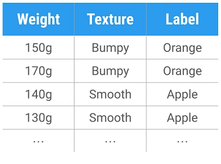

### Writing your first program in machine learning.

Pre-requisites
1.  Install python. Download and install it from [here](https://www.python.org/downloads/)
2. Install scikit-learn library. For downloading and installation, follow the steps mentioned [here](http://scikit-learn.org/stable/install.html)
3. create a python file `hello_world.py`.
4. Now, add the very first line of code in `hello_world.py` which is to import scikit-learn. This would also validate if scikit-learn has been installed and configured correctly or not. Following is how content of file `hello_world.py` should look like now:
````
import sklearn
````
5. Run this program on the terminal or from any IDE of your choice. If the program executes successfully, it means scikit-learn's installation and import has been successful.

6. Next thing, we are going to do is, to import `tree` class from `scikit-learn` library. Following is the synctax for it:
````
from sklearn import tree
````
7. Next, let us print some text to validate if everything is fine till now. Let us add a sample print line:
````
print("yay m born")
````

Since we are using supervised learning approach here, the first thing to have is training data. These are examples of the problem we want to solve. For our problem, we're going to write a function to classify a piece of fruit that will take a description of the fruit as input, and predict whether it's an apple or oranges output based on features like its weight and texture.

To collect our training data, imagine we head out to an orchard and look at different apples and oranges and start creating a table which describes their measurements. In machine learning world, we call these measurements as features.

 To keep things simple, Let us have a look at the table below. We use two features. How much each fruit weighs and it's texture which can be bumpy or smooth. A good feature makes it easy to discriminate between different types of fruits. Each row in our training data. The last column is called the label it identifies what type of fruit is in each row and there are just two possibilities apples and oranges the whole table is our training data. What is happening in-turn is, our classifier will be trained on this data to identify outputs.
      
      
  


You can think of `features` as the inputs of the classifier and `labels` as the output. We would change the variable type of all our `features` to `integers` instead of `strings`, so we use `0` for bumpy and `1` for smooth. We do the same for our `labels`, so we use `0` for Apple and `1` for orange.

8. Now let us add the line in our program depicting the above logic like this:
````
#features 1 for smooth and 0 for bumpy , the first value is the weight
#labels 0 for apple and 1 for orange
features = [[140, 1], [130, 1], [150, 0], [170, 0]]
labels = [0, 0, 1, 1]
````

